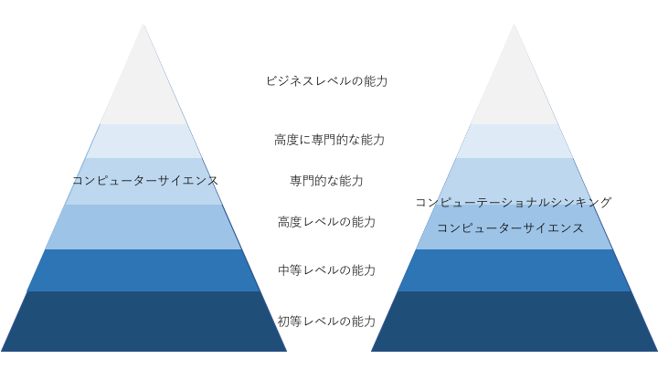

## ないから作った子供たちのためのロボット

---
## 自己紹介

### <ruby>中尾<rp>（</rp><rt>ナカオ</rt><rp>）</rp></ruby> <ruby>瑛佑<rp>（</rp><rt>ヨウスケ</rt><rp>）</rp></ruby>

---
職歴
- 陸上自衛隊
- SI企業
- eラーニングベンチャー
- 大手家電メーカーの教育企業
- 医療系コンサル企業
- 教育系スタートアップ企業
- [合同会社 The Waggle](https://thewaggle.co.jp/) CEO
- [株式会社 for Our Kids](https://4ok.jp) co-founder

---

---
## PETSって何？
### 論理的思考力を鍛える
PCもインターネットも使わないで
プログラミングして動かすロボットです。
---
## PETSが生まれた背景

エンジニアのコミュニティ(TMCN)から自分の子供に教えるのに最適な教材はないか探した時に
最初に触らせるのに最適な教材が無かった。

### 無いなら作ろう！
---
### PETS 1号機

---
### PETS 2号機

---
### カリキュラムを作ろう。

- 僕が培ってきた教材作成のノウハウをを全てここにつぎ込もう。

---
### 何を教えたいのか？
- 失敗から学ぶ体験 |
- 自ら楽しく練習する態度 |
- 視点を変えるという事 |
- 関係を整理する能力 |
---
<iframe width="560" height="315" src="https://www.youtube.com/embed/_bQkpT5e6tQ" frameborder="0" allow="autoplay; encrypted-media" allowfullscreen></iframe>
---
### WorkShop

---
#### 「自分達の子供の為に」から、「皆んなの子供の為に」
##### for Our Kids.Inc

---
#### 小学校 2020年プログラミング必修化

- 子供の為に先生にも楽しんでもらいたい |
- 先生の負担を減らす。 |
- 先生の教育を提供できる。 |
- プログラミング的思考って何だ |
---
### プログラミング的思考とは？

- プログラミング思考って何？
  - 発達の段階に即して、「プログラミング的思考」（自分が意図する一連の活動を実現するために、どのような動きの組合せが必要であり、一つ一つの動きに対応した記号を、どのように組み合わせたらいいのか、記号の組合せをどのように改善していけば、より意図した活動に近づくのか、といったことを論理的に考えていく力） [5]を育成すること。

  [小学校段階におけるプログラミング教育の在り方について（議論の取りまとめ）](http://www.mext.go.jp/b_menu/shingi/chousa/shotou/122/attach/1372525.htm)
---
### [5]いわゆる「コンピュテーショナル・シンキング」の考え方を踏まえつつ、プログラミングと論理的思考との関係を整理しながら提言された定義である。
---
### コンピュテーショナル・シンキングとは？
2006年：Jannette M. Wing「Computational thinking」

- 問題解決、システムデザイン、人間行動の理解に、コンピュータサイエンスの概念を援用する思考法である
- コンピュータサイエンスはプログラミングと同じではない
- 「コンピュータサイエンティストのように思考すること」はプログラミングよりも高度である
---
### プログラミング的思考の意図？

---
### プログラミング的思考の意図？

---
平成２９年１１月１４日
第７回 経済・財政一体改革推進委員会
経済社会の活力ワーキング・グループ
 [文部科学省説明資料]()

---

### わかんなくなっちゃった　w

---

 ### 先生達が「教材」を作れるようにしよう。

---

---
### 何を問いかけるのか？によっていくらでも学ばせられる
---

### PETSを使うと「楽しい」体験を通した「学習」環境を誰でも作れる

---
### PETS 現行モデル

---
## 学校での実績
- 第１学年　算数「ばしょをあらわそう」
- 第１学年　総合「プログラミング授業公開」
- 第１学年　道徳「主として集団や社会との関わりに関すること」
---
- 第２学年　総合　「順次処理の理解」
- 第２学年　国語　「きせつのことば④　冬がいっぱい」　
- 第２学年　生活科「作って試して（プログラミングってなぁに）」
---
- 第３学年　算数　「プログラミングで算数」
- 第３学年　公開授業「PETSでプログラミング体験」
---
- 特別支援学級　生活　「プログラミングの授業」
- 第１学年～第６学年（全校生徒）総合「プログラミング体験」
- 第3－6学年　パソコン倶楽部　「PETSでプログラミング体験　
---

---
## 一番最後に伝えたい事

子供達の生きる未来を予測できない以上、自ら考え克服していく力を身につけて欲しい。

- 健康な体、体力 |
- 人間力 |
- 自ら考える力 |
- 教えられない、自ら学びとるものばかり。 |

---

### 教えるのではなく、学べる環境をデザインしよう。
